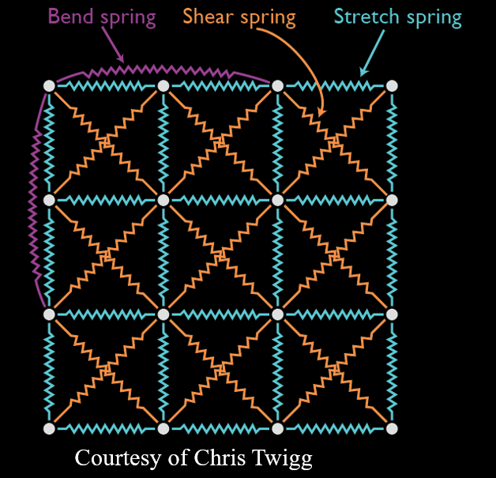

# HW1 REPORT

110511010 楊育陞

## Introduction

In this homework, we implement particle systems with different integrators and parameters. Using these particle systems, we simulate the motion of cloth and collision with a sphere. Furthermore, by comparing the results of different integrators and parameters, we analyze the effect of them on the simulation. Finally, I implement a bonus feature to constrain some particles of the cloth.

## Fundamentals

### 1. Structure of Cloth in Particle System

The structure of cloth is a 2D grid of particles, with each particle connected to its neighbors by springs. The springs are divided into three types:

1. **Structural Springs**: connect the particle to its neighbors in the same row and column.
2. **Shear Springs**: connect the particle to its diagonal neighbors.
3. **Bend Springs**: connect the particle to its neighbors in the same row and column with a distance of 2.

<div align="center">
    
</div>

### 2. Internal Forces

There are two types of internal forces in the cloth:

1. **Spring Force**: The force exerted by the springs connecting the particles. In this homework, the spring force is calculated by following formula, where $k_{spring}$ is the parameter `springCoef`:

$$
F_{spring} = -k_{spring} \cdot (|x_{a} - x_{b}| - l_{0}) \cdot \frac{{x_{a} - x_{b}}}{{|x_{a} - x_{b}|}}
$$

2. **Damping Force**: The force that resists the motion of the particles. In this homework, the damping force is calculated by the following formula, where $k_{damping}$ is the parameter `damperCoef`:

$$
F_{damping} = -k_{damping} \cdot \left(\frac{(v_{a}-v_{b}) \cdot (x_{a}-x_{b})}{|x_{a}-x_{b}|}\right) \frac{x_{a}-x_{b}}{|x_{a}-x_{b}|}
$$

### 3. Collision

In this homework, the collision is detected by the distance between the particle and the sphere, also the velocity of the particle. If collision happends, the particle will be applied with a collision force, which is calculated by the following formula:

$$
v_{a} = \frac{{m_{a}u_{a} + m_{b}u_{b} - m_{b}C_{R}(u_{a} - u_{b})}}{{m_{a} + m_{b}}}
$$

We only consider the normal direction of the collision, also we assume the sphere is fixed.

### 4. Integrators

1. **Explicit Euler**: The simplest integrator, which is easy to implement but not stable for large time steps.
2. **Implicit Euler**: A more stable integrator than explicit Euler, but requires simulating a linear system in each time step.
3. **Midpoint Method**: Similar to Euler's method, but uses the average of the current velocity and the velocity at the midpoint of the time step.
4. **Runge-Kutta 4th Order**: The most accurate integrator among the four, but also the most computationally expensive. The formula is as follows:

$$
\begin{aligned}
k_{1} &= h \cdot f(t, y) \\
k_{2} &= h \cdot f(t + \frac{h}{2}, y + \frac{k_{1}}{2}) \\
k_{3} &= h \cdot f(t + \frac{h}{2}, y + \frac{k_{2}}{2}) \\
k_{4} &= h \cdot f(t + h, y + k_{3}) \\
y(t + h) &= y(t) + \frac{k_{1} + 2k_{2} + 2k_{3} + k_{4}}{6}
\end{aligned}
$$

## Implementation

### 1. Construct the connections of springs

To construct the connections of each spring, I find the index of the particles that the spring connects to, and calculate the length of the spring, then store them in the `_springs` vector with type of spring.
I handle edge cases by only iterating the particles that are not on the edge of the cloth.

### 2. Compute the internal forces

To compute the internal forces, I iterate all the springs and calculate the spring force and damping force by the formulas mentioned above. Then I calculate the acceleration caused by the forces and accumulate them to the particles.

### 3. Handle the collision 

To handle the collision, I iterate all the particles and calculate the distance between the particle and the sphere. If the distance is less than the radius of the sphere by a correction value, the particle is in collision. Then it will first be moved out of the sphere, and then be applied with the collision force normal to the sphere. I use 0.01 as the correction value.

### 4. Implement the integrators

1. **Explicit Euler**: The position and velocity of the particles are updated by current integration of velocity and acceleration.

```cpp
for (int i = 0; i < particles.size(); i++) {
    particles[i]->velocity() += particles[i]->acceleration() * deltaTime;
    particles[i]->position() += particles[i]->velocity() * deltaTime;
}
```

2. **Implicit Euler**: The position and velocity of the particles are updated by the next integration of velocity and acceleration. I back up the original position and velocity first, then update the position and velocity th get the next state. Finally, I restore the original position and velocity and update with the next state.

```cpp
std::vector<Eigen::Matrix4Xf> oriPositions, oriVelocitys;
for (int i = 0; i < particles.size(); i++) {
    // Back up the original state
    oriPositions.push_back(particles[i]->position());
    oriVelocitys.push_back(particles[i]->velocity());
    // To next state
    particles[i]->position() += particles[i]->velocity() * deltaTime;
    particles[i]->velocity() += particles[i]->acceleration() * deltaTime;
}
simulateOneStep(); // Get the next state
// Restore the original state and update with the next state
for (int i = 0; i < particles.size(); i++) {
    particles[i]->position() = oriPositions[i] + deltaTime * particles[i]->velocity();
    particles[i]->velocity() = oriVelocitys[i] + deltaTime * particles[i]->acceleration();
}
```

3. **Midpoint Method**: The position and velocity of the particles are updated by the average of the current state and the next state. This is similar to the implicit Euler, but the next state is calculated by the average of the current state and the next state.

```cpp
std::vector<Eigen::Matrix4Xf> oriPositions, oriVelocitys;
for (int i = 0; i < particles.size(); i++) {
    // Back up the original state
    oriPositions.push_back(particles[i]->position());
    oriVelocitys.push_back(particles[i]->velocity());
    // To the midpoint
    particles[i]->position() += particles[i]->velocity() * deltaTime * 0.5f;
    particles[i]->velocity() += particles[i]->acceleration() * deltaTime * 0.5f;
}
simulateOneStep(); // Get the next state at the midpoint
// Restore the original state and update with the next state
for (int i = 0; i < particles.size(); i++) {
    particles[i]->position() = oriPositions[i] + deltaTime * particles[i]->velocity();
    particles[i]->velocity() = oriVelocitys[i] + deltaTime * particles[i]->acceleration();
}
```

4. **Runge-Kutta 4th Order**: The position and velocity of the particles are updated by the weighted average of the four states. The four states are calculated by the weighted average of the current state and the next state.

```cpp
  std::vector<Eigen::Matrix4Xf> oriPositions, oriVelocitys, k1, k2, k3, k4, l1, l2, l3, l4;
  for (int i = 0; i < particles.size(); i++) {
    oriPositions.push_back(particles[i]->position());
    oriVelocitys.push_back(particles[i]->velocity());
    k1.push_back(particles[i]->velocity() * deltaTime);
    l1.push_back(particles[i]->acceleration() * deltaTime);
    particles[i]->position() = oriPositions[i] + k1[i] * 0.5f;
    particles[i]->velocity() = oriVelocitys[i] + l1[i] * 0.5f;
  }
  simulateOneStep();
  for (int i = 0; i < particles.size(); i++) {
    k2.push_back(particles[i]->velocity() * deltaTime);
    l2.push_back(particles[i]->acceleration() * deltaTime);
    particles[i]->position() = oriPositions[i] + k2[i] * 0.5f;
    particles[i]->velocity() = oriVelocitys[i] + l2[i] * 0.5f;
  }
  simulateOneStep();
  for (int i = 0; i < particles.size(); i++) {
    k3.push_back(particles[i]->velocity() * deltaTime);
    l3.push_back(particles[i]->acceleration() * deltaTime);
    particles[i]->position() = oriPositions[i] + k3[i];
    particles[i]->velocity() = oriVelocitys[i] + l3[i];
  }
  simulateOneStep();
  for (int i = 0; i < particles.size(); i++) {
    k4.push_back(particles[i]->velocity() * deltaTime);
    l4.push_back(particles[i]->acceleration() * deltaTime);
    particles[i]->position() = oriPositions[i] + (k1[i] + 2 * k2[i] + 2 * k3[i] + k4[i]) / 6.0f;
    particles[i]->velocity() = oriVelocitys[i] + (l1[i] + 2 * l2[i] + 2 * l3[i] + l4[i]) / 6.0f;
  }
```

## Results and Discussion

### 1. The difference between integrators

### 2. Effect of parameters

1. **springCoef**:

2. **damperCoef**:

## Bonus

## Conclusion
